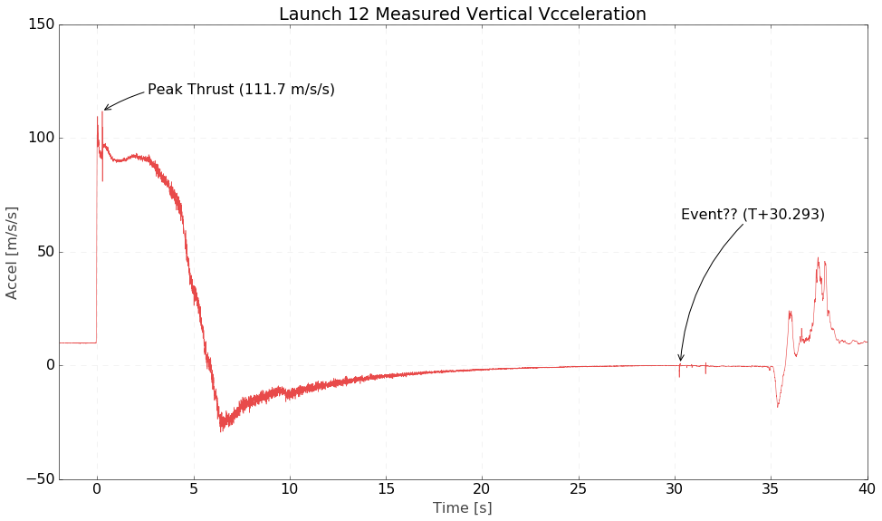
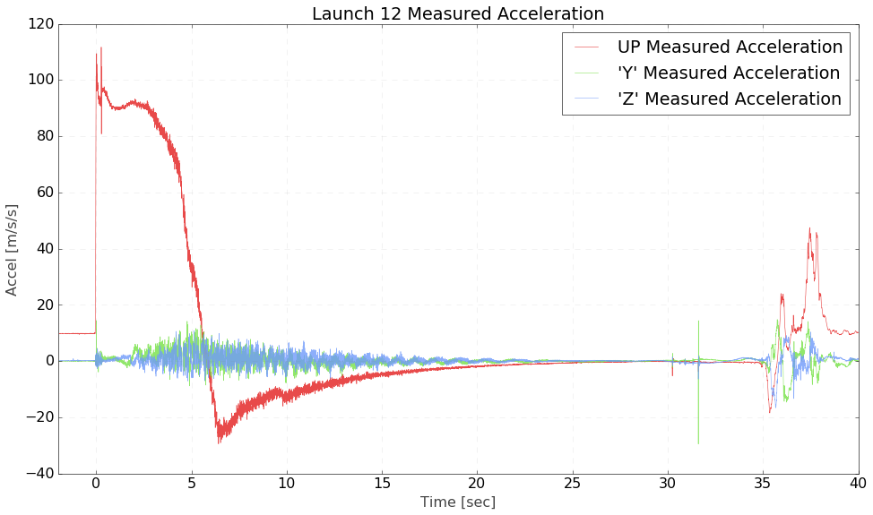
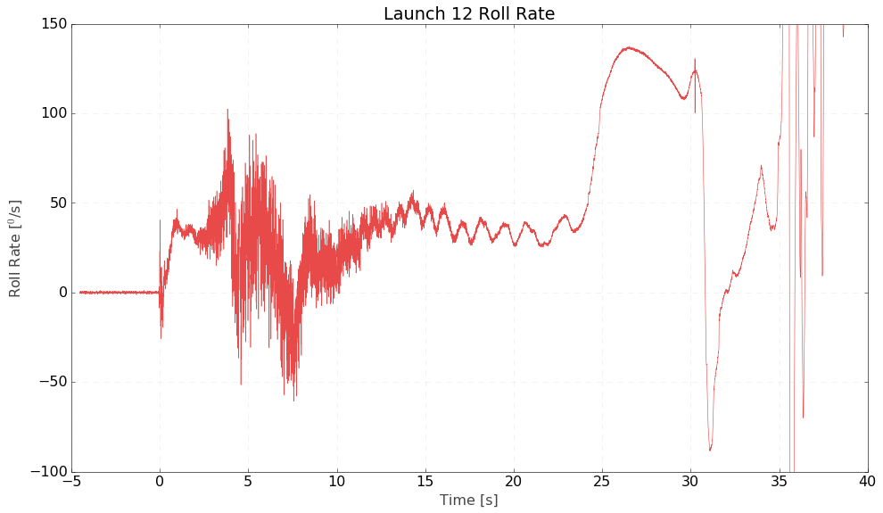
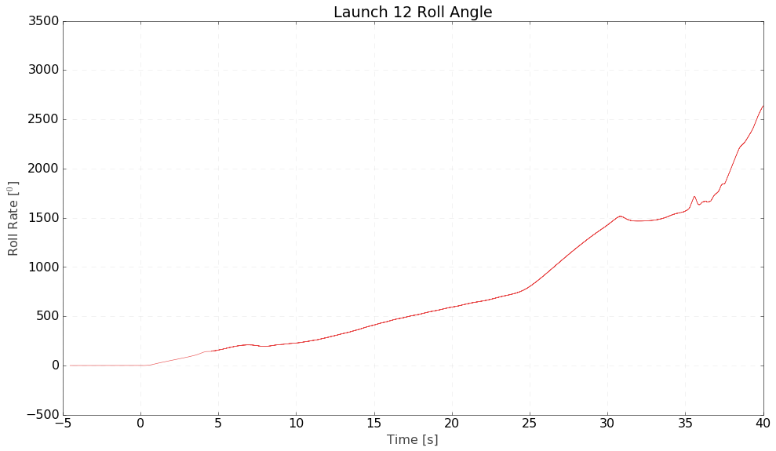
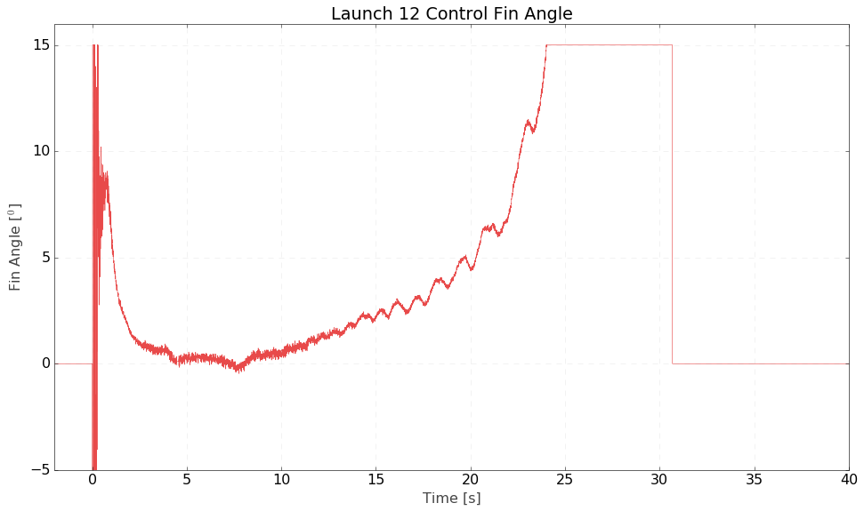
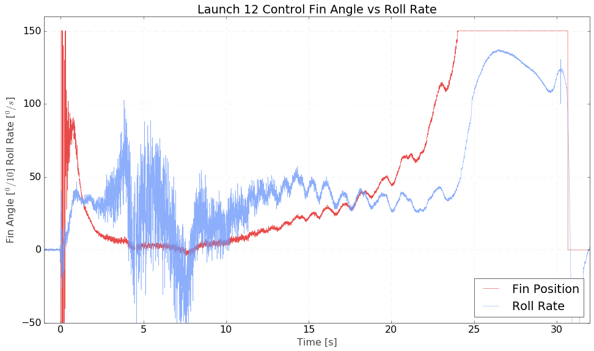

# Launch 12 Data First Look

Launch 12 lifted off at 11:15 am Sunday July 19th (19:15 UTC)

How did we do? Let's take a first look at the data:

## Launch Time

Look for the umbilical disconnect signal. We'll write that down at $t_0$

    # [0]SEQN, [1]Timestamp, [2]Detect
    90773,117853569585227,0

## Acceleration

Here are the acceleration curves for the flight.

# Roll Rate

This launch included a student designed roll control experiment. Four small canards in the middle of the rocket are controled by the flight comptuer and a PI controller was allowed to control the roll rate of the rocket, trying to set it to zero.

# Total Roll Angle

How much did we spin?

This was worse that expected performance, but also includes a lot of data that we'll find useful for future flights!

## Roll Canard Angle

So how did the control system react to the flight?

