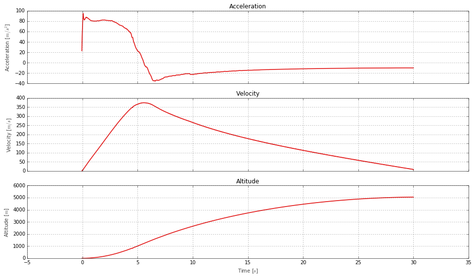
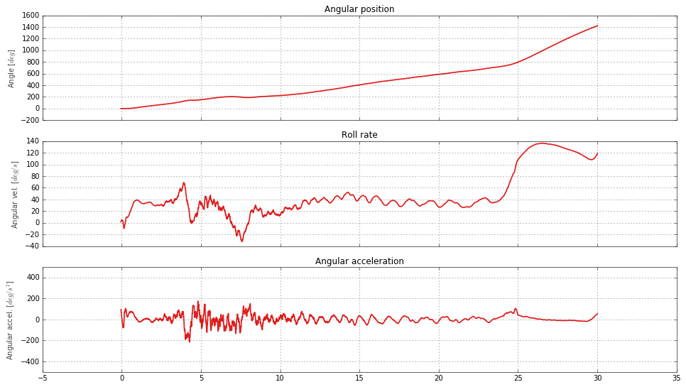

# Initial Roll Control Analysis  
*by William Harrington*  
*Portland State Aerospace Society*  

The purpose of this notebook is to take a detailed look at how the roll control system worked during Launch-12.  
  
We will start by extracting data from the csv files.

### Accelerometer analysis

Now that we've got everything imported and data extracted from the csv files we can start analyzing it.  
  
Let's take a look at the accelerometer readings first as the velocity of the rocket and altitude of the rocket play an essential part in roll control authority.

    Max velocity: 374.57 m/s
    Peak altitude: 5044.53 m

These are the expected curves for velocity and altitude. This is a good sign as these played a crucial role in the simulation that was used for designing the roll control algorithm.  

### Gyro analysis

Now let's take a look at the gyro readings and see how the roll control algorithm performed.  

    Max angular position: 1422.57 degrees
    Total revolutions: 3.95
    Max angular velocity: 136.56 deg/s
    Max angular acceleration: 175.66 deg/s^2
    Average angular velocity: 47.45 deg/s
    Average angular acceleration: 4.00 deg/s^2

  
These are some interesting results. The roll control algorithm was designed to prevent any revolutions at all.  
However, the rocket ended up spinning about 4 times according to this data.  
Since the average angular acceleration is close to 0, it looks like the algorithm was successful in keepting the roll rate relatively constant through certain periods of the flight.
